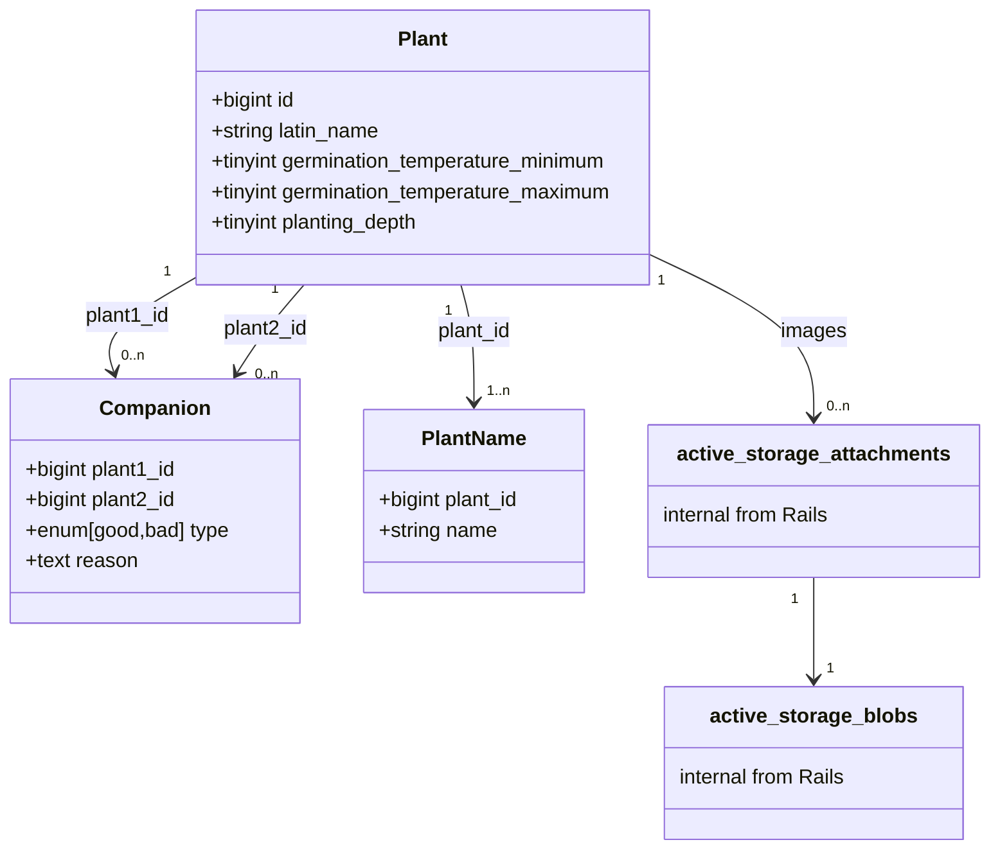

# Garden

## Development

1. Clone Git repository
2. Run `bin/setup_history_files`
3. With [docker-compose](https://github.com/docker/compose), spin up development environment: `docker-compose up`.
4. Access the Docker container `web_app` with `docker exec -it CONTAINER_ID bash`.

### Setup

Inside the Docker container, run `bin/setup`.

### Run the Rails Application

Inside the Docker container, run `bin/dev`, then access `http://localhost:3000`.

### Run Tests and Continuous Integration

Inside the Docker container, run `bin/ci`.

### Connect to SQLite Database

Inside the Docker container, run `sqlite3 db/development.sqlite3`.

## Architecture

Class diagram generated with [Mermaid](https://github.com/mermaid-js/mermaid).

