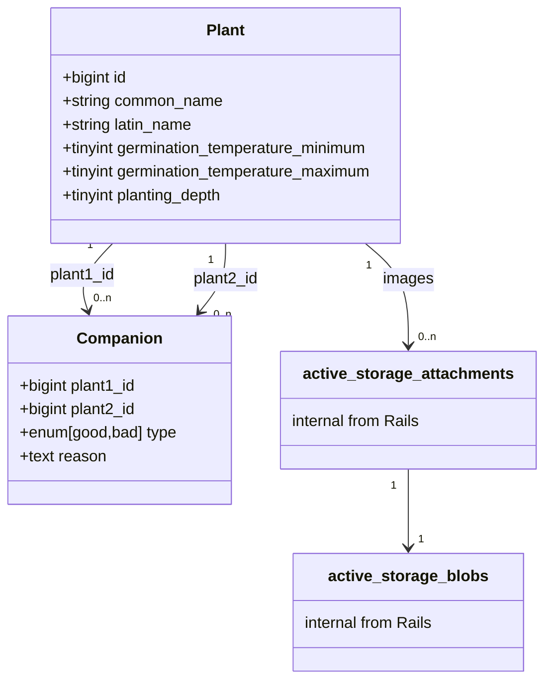

# Garden

## Development

1. Clone Git repository
2. Run `bin/setup_history_files`
3. With [docker-compose](https://github.com/docker/compose), spin up development environment: `docker-compose up`.
4. Access the Docker container `web_app` with `docker exec -it CONTAINER_ID bash`.
5. Do what you need to do. Some examples are listed below...

### Setup the Rails Application

Run `bin/setup`.

### Run the Rails Application

Run `bin/dev`, then access `http://localhost:3000`.

### Run Linters, Tests and Audits

Run `bin/ci`.

### Connect to SQLite Database

Run `sqlite3 db/development.sqlite3`.

### Connect to Web Application, Redis or Another Process Managed by Overmind

Run `bin/overmind connect [process_name]`.
Disconnect from the process window with `Ctrl + b`, then `d`.

### Manage JavaScript Dependencies

Run `bin/importmap` to see the available commands.

## Architecture

Class diagram generated with [Mermaid](https://github.com/mermaid-js/mermaid).

## Design

Avoid creating global CSS rules by relying solely on the utility-first approach
of Tailwind CSS to create view components whenever there is repetition.
